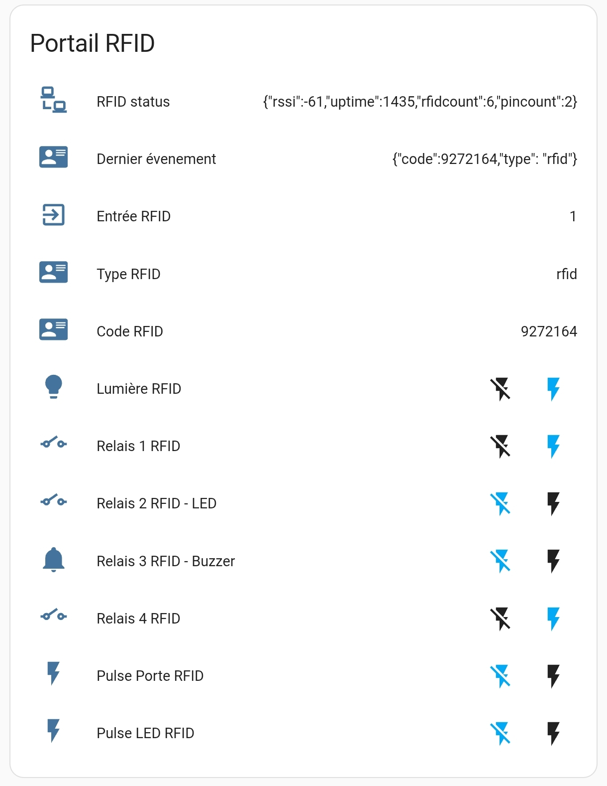
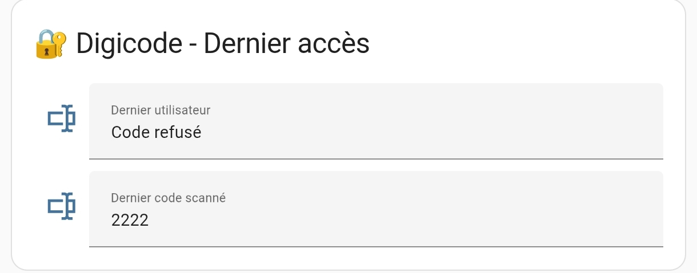

Digicode wiegand 
================

Base sur le code https://github.com/algorytmix02/wiegand-2-mqtt/blob/main/RFID_Wiegand_MQTT.ino
avec quelques adaptations pour rendre le code compatible pour un esp32.
De même, les libellés mqtt ont été ajustés pour être plus parlants.

# Fonctionnement global
Une entrée au niveau du digicode envoie les informations au contrôleur (esp32 ici).
Le contrôleur envoie les informations en mqtt.
Home assistant (HA) récupère les donnes envoyées, elles sont contrôlées via un script python. Si l'utilisateur est autorisé alors on envoie en mqtt les données validées sur un topic dédié. Si non, on envoie sur un autre topic. Ces 2 topics sont scrutés par HA, a chaque modification de l'un ou l'autre on lance un automatisme qui traite la demande.

# Package rfidwiegand 
```yaml=
rfidwiegand:
  mqtt:
    sensor:
      - name: "RFID status"
        unique_id: clavier_rfid_status
        state_topic: "rfid/status"
        icon: mdi:lan-connect

      - name: "Dernier évenement"
        unique_id: clavier_rfid_last_event
        state_topic: "rfid/event"
        icon: mdi:card-account-details

      - name: "Code RFID"
        unique_id: clavier_rfid_code
        state_topic: "rfid/event"
        value_template: "{{ value_json.code }}"
        icon: mdi:card-account-details

      - name: "Type RFID"
        unique_id: clavier_rfid_type
        state_topic: "rfid/event"
        value_template: "{{ value_json.type }}"
        icon: mdi:card-account-details

      - name: "Entrée RFID"
        unique_id: clavier_rfid_input
        state_topic: "rfid/input"
        icon: mdi:login-variant
        
      - name: "ok entrée RFID"
        unique_id: rfid_access_ok
        state_topic: "rfid/ok"
        icon: mdi:login-variant
    
      - name: "Nok entrée RFID"
        unique_id: rfid_access_nok
        state_topic: "rfid_nok"
        icon: mdi:login-variant

    switch:
      - name: "Relais 1 RFID"
        unique_id: clavier_rfid_relay1
        state_topic: "rfid/portail"
        command_topic: "rfid/portail"
        payload_on: 1
        payload_off: 0
        state_on: 1
        state_off: 0
        optimistic: true
        icon: mdi:electric-switch

      - name: "Relais 2 RFID - LED"
        unique_id: clavier_rfid_relay2_led
        state_topic: "rfid/ledclavier"
        command_topic: "rfid/ledclavier"
        payload_on: 1 # Vert
        payload_off: 0 # Rouge
        state_on: 1
        state_off: 0
        optimistic: true
        icon: mdi:electric-switch

      - name: "Relais 3 RFID - Buzzer"
        unique_id: clavier_rfid_relay3_buzzer
        state_topic: "rfid/buzzer"
        command_topic: "rfid/buzzer"
        payload_on: 1
        payload_off: 0
        state_on: 1
        state_off: 0
        optimistic: true
        icon: mdi:bell

      - name: "Relais 4 RFID"
        unique_id: clavier_rfid_relay4
        state_topic: "rfid/relay4"
        command_topic: "rfid/relay4"
        payload_on: 1
        payload_off: 0
        state_on: 1
        state_off: 0
        optimistic: true
        icon: mdi:electric-switch

      - name: "Pulse Porte RFID"
        unique_id: clavier_rfid_pulse1
        state_topic: "rfid/pulseporte"
        command_topic: "rfid/pulseporte"
        payload_on: 1
        payload_off: 0
        state_on: 1
        state_off: 0
        optimistic: true
        icon: mdi:flash

      - name: "Pulse LED RFID"
        unique_id: clavier_rfid_pulse2
        state_topic: "rfid/pulseled"
        command_topic: "rfid/pulseled"
        payload_on: 1
        payload_off: 0
        state_on: 1
        state_off: 0
        optimistic: true
        icon: mdi:flash

      - name: "Lumière RFID"
        unique_id: clavier_rfid_light
        state_topic: "rfid/light"
        command_topic: "rfid/light"
        payload_on: 1
        payload_off: 0
        state_on: 1
        state_off: 0
        optimistic: true
        icon: mdi:lightbulb
```
Ce package permet de récupérer les données du digicode en mqtt.

# Fichier de configuration des utilisateurs 
```yaml=
user1:
  label: "Utilisateur 1"
  code: "1234"
  type: "pin"
  active: true

user2:
  label: "Utilisateur 2"
  code: "2345"
  type: "pin"
  active: true

userTemp:
  label: "Utilisateur temporaire"
  code: "9876"
  type: "pin"
  active: false

u1_rfid:
  label: "Utilisateur 1"
  code: "6414522"
  type: "rfid"
  active: true
  
```
Les utilisateurs sont gérés via ce fichier. Le paramètre `active` permet de désactiver un utilisateur non régulier.
# Script python 
```python=
#!/usr/bin/env python3
import yaml
from datetime import datetime
import sys
import os
import paho.mqtt.client as paho
import json

# Paramètres récupérés
code = sys.argv[1]
type_ = sys.argv[2]

# Fichier de log
log_file = "/config/digicode_logs.txt"

#MQTT
broker = "mymqtt.local" # IP ou alias du broner
port = 1883 # port du mqtt
userMqtt = 'myUser' # utilisateur mqtt
passwdMqtt = 'fuck1ngDifficultPassword!' # mot de passe mqtt
topicOk = 'rfid/ok'
topicNok = 'rfid/nok'

def on_publish(client, userdata, result):  # create function for callback
    pass

def sendMqtt(topic, data):
    client = paho.Client("digicodeCheck")  # create client object
    client.username_pw_set(userMqtt, passwdMqtt)
    client.on_publish = on_publish  # assign function to callback
    client.connect(broker, port)  # establish connection
    ret = client.publish(topic, data)  # publish

# Charger les utilisateurs
with open("/config/digicode_users.yaml", "r", encoding="utf-8") as f:
    users = yaml.safe_load(f)

# Rechercher l'utilisateur
matched_label = None
for key, user in users.items():
    if user.get("active")== True and str(user.get("code")) == code and user.get("type") == type_:
        matched_label = user.get("label")
        break

# Heure actuelle
now = datetime.now().strftime("%Y-%m-%d %H:%M:%S")

# Journaliser
if matched_label:
    log_line = f"[{now}] ✅ Accès autorisé : {matched_label} ({type_})\n"
    dataOk = {
        "dateHeure": now,
        "type": type_,
        "user": matched_label
    }
    sendMqtt(topicOk, json.dumps(dataOk, indent=4))
else:
    log_line = f"[{now}] ❌ Accès refusé : code={code}, type={type_}\n"
    dataNok = {
        "dateHeure": now,
        "type": type_,
        "code": code
    }
    sendMqtt(topicNok, json.dumps(dataNok, indent=4))
    
print(log_line)
with open(log_file, "a", encoding="utf-8") as log:
    log.write(log_line)
```

# Package digicode
```yaml=
digicode:
  homeassistant:
    customize:
      input_text.digicode_log:
        friendly_name: Dernier utilisateur
      input_text.digicode_lastcode:
        friendly_name: Dernier code scanné

  input_text:
    digicode_log:
      max: 30
    digicode_lastcode:
      max: 20
      
  shell_command:
    digicode_check: "python3 /config/scripts/digicode_check.py {{ code }} {{ type }}"

  automation:
    - alias: Digicode - Vérifie le code via script Python
      trigger:
        - platform: mqtt
          topic: "rfid/event"
      variables:
        payload: "{{ trigger.payload_json }}"
        code: "{{ payload.code }}"
        type: "{{ payload.type }}"
      action:
        - service: shell_command.digicode_check
          data:
            code: "{{ code }}"
            type: "{{ type }}"
            
```
Une fois toutes les infos récupérées, on peut les afficher dans HA.
